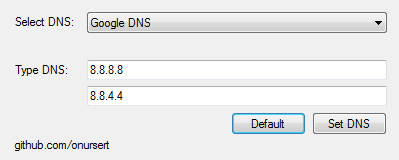

# DNS Changer

DNS Changer - 2014 (C#)

DNS Changer is a tool for Windows PCs allows you to change the DNS servers you use to surf the web.

The interface consists of a small screen that allows you to choose between 2 DNS servers (Google DNS, Open DNS) or you can enter another DNS servers manually. Beside these features you can reset your DNS address to default by clicking 'Default' button.

DNS Changer app doesn't require installation but does need to run with administrator privileges.

<a href="https://github.com/onursert/DNSChanger/raw/master/DNSChanger.exe">Download DNS Changer</a>
